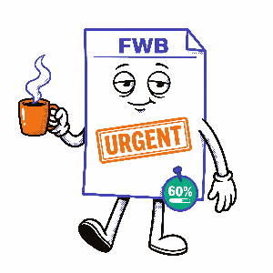
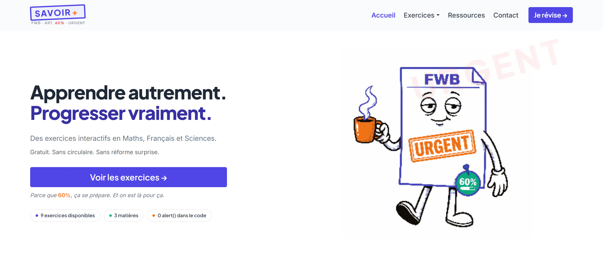

# SavoirPlus

<table width="100%" cellpadding="0" cellspacing="0" border="0" style="border: none;">
<tr>
<td width="65%" valign="middle" style="border: none; padding: 0 24px 0 0;">
  <strong>Plateforme éducative interactive</strong> · HTML5 + Bootstrap 5.3.3 + JavaScript ES6+<br>
  Évaluation finale — WEB DESIGNER UI/UX · IFOSUP Wavre · Juin 2026<br>
  Auteur : <strong>Amandine Van de Winckel</strong> · <a href="mailto:hello@bodam.agency">hello@bodam.agency</a><br>
  Live : <a href="https://savoirplus-pied.vercel.app">savoirplus-pied.vercel.app</a>
</td>
<td width="35%" valign="middle" align="center" style="border: none">
  
</td>
</tr>
</table>

---

## Aperçu



SavoirPlus propose 9 exercices interactifs en **Maths**, **Français** et **Sciences**, accompagnés d'un système de gamification complet. La mascotte **La Circulaire** — feuille A4 froissée vivante — évolue visuellement au fil de la progression de l'élève.

**Fonctionnalités :**

- 9 quiz interactifs — 6 QCM (Maths + Sciences) + 3 exercices à trous (Français)
- Système XP, niveaux (5 paliers) et achievements (3 badges)
- Timer 60s avec bonus vitesse × 2 si réponse en ≤ 17s
- Progression sauvegardée en `localStorage` (résiste aux rechargements)
- Mascotte animée 5 états selon le timer (cool → en feu)
- Fiches de révision accordéon + vidéo pédagogique embarquée
- Formulaire de contact avec validation UI (zéro `alert()`)
- Responsive mobile-first · Accessibilité WCAG AA

---

## Stack technique

| Technologie    | Version | Rôle                                                        |
| -------------- | ------- | ------------------------------------------------------------ |
| HTML5          | —      | Structure sémantique, ARIA, accessibilité                  |
| Bootstrap      | 5.3.3   | Grid, composants (Modal, Toast, Accordion), utilitaires      |
| JavaScript     | ES6+    | Logique applicative — vanilla, zéro framework              |
| CSS Custom     | —      | Override Bootstrap via `--bs-*`, design system, animations |
| Variable Fonts | OFL 1.1 | Polices locales — fonctionne hors connexion                 |

**Parti pris :** Bootstrap et les polices sont fournis **en local** — aucune dépendance CDN externe, rendu identique avec ou sans connexion internet.

> **Décision consciente — CSS inutilisé :** Bootstrap 5.3.3 contient ~31 KB de règles non utilisées par ce projet. La purge (PurgeCSS / tree-shaking) n'a pas été mise en place car elle sortirait du scope du brief IFOSUP et complexifierait la chaîne de build. Ce compromis est acceptable pour un projet académique mono-page.

---

## Prérequis

| Outil                       | Version minimale                      | Usage                                                     |
| --------------------------- | ------------------------------------- | --------------------------------------------------------- |
| Navigateur moderne          | Chrome 90+ / Firefox 88+ / Safari 14+ | Lecture du projet                                         |
| Laragon *ou* serveur local | toute version                         | Évite les restrictions `file://` sur les fonts locales |

> **Note :** l'ouverture directe de `index.html` via `file://` peut bloquer le chargement des fonts locales sur certains navigateurs (restriction CORS). Passer par Laragon (`http://savoirplus.test`) ou cloner depuis GitHub garantit un rendu identique à la production.

---

## Installation & lancement local

```bash
# 1. Cloner ou décompresser le projet
# (pas de dépendances npm — aucun install requis)

# 2. Via Laragon
#    Placer le dossier dans C:\laragon\www\
#    Accéder à http://savoirplus.test

# 3. Via VS Code Live Server
#    Clic droit sur index.html → Open with Live Server

# 4. Ouverture directe (fonts système en fallback)
#    Double-clic sur index.html
```

---

## Structure

```
savoirplus/
│
├── index.html                        # Page unique — toute la plateforme
│
├── css/
│   ├── fonts/                        # Polices locales (Variable Fonts TTF)
│   │   ├── plus-jakarta-sans.ttf     # Titres, UI, labels — weights 100-900
│   │   ├── inter.ttf                 # Corps de texte — weights 100-900
│   │   └── jetbrains-mono.ttf        # Timer, compteurs XP, code — weights 100-900
│   ├── reset.css                     # Reset minimaliste (box-sizing, margin, font:inherit)
│   ├── bootstrap.min.css             # Bootstrap 5.3.3 — local (minifié)
│   ├── style.css                     # Design system + composants custom (16 sections)
│   └── print.css                     # Styles impression (masque gamification, URL vidéo)
│
├── js/
│   ├── app.js                        # Logique complète (9 sections, JSDoc)
│   └── bootstrap.bundle.min.js       # Bootstrap JS + Popper — local
│
└── img/
    ├── favicon.svg                   # Favicon — + orange sur fond indigo (onglet navigateur)
    ├── logo.svg                      # Logo SAVOIR+ tampon — README + documentation
    ├── screenshot.webp               # Aperçu desktop hero — README
    ├── la-circulaire-motion1.gif     # Mascotte animée hero — GIF (290 KB, fond transparent)
    ├── la-circulaire-fallback.webp   # Hero mobile (160px) + fallback onerror GIF (7 KB, 176×176px)
    ├── la-circulaire.webp            # Mascotte statique — chip gamification (5 KB, 176×176px)
    ├── illus-maths.webp              # Illustration Maths — cards + modal
    ├── illus-francais.webp           # Illustration Français — cards + modal
    ├── illus-sciences.webp           # Illustration Sciences — cards + modal
    └── motion2/                      # 5 états La Circulaire — toast bonus 17s (7–12 KB, 240×240px)
        ├── cool.webp                 # > 75% temps restant
        ├── tiede.webp                # 50–75%
        ├── chaud.webp                # 25–50%
        ├── critique.webp             # 10–25%
        └── enfeu.webp                # 0s — entièrement en feu
```

---

## Design system

### Palette

| Rôle           | Token               | Hex                        |
| --------------- | ------------------- | -------------------------- |
| Primaire        | `--bs-primary`    | `#4F46E5` — Indigo 600  |
| Secondaire      | `--bs-secondary`  | `#F97316` — Orange 500  |
| Succès         | `--color-emerald` | `#10B981` — Emerald 500 |
| Fond global     | `--color-bg`      | `#F9FAFB` — Gray 50     |
| Texte principal | `--color-text`    | `#1F2937` — Gray 800    |

**Couleurs par matière :**

| Matière  | Fond        | Principale  | Foncée     |
| --------- | ----------- | ----------- | ----------- |
| Maths     | `#EEEDFE` | `#7F77DD` | `#3C3489` |
| Français | `#FFF7ED` | `#F97316` | `#C2410C` |
| Sciences  | `#E8F5F0` | `#409A79` | `#2D6E56` |

### Typographie

| Police            | Usage                             | Variable CSS    |
| ----------------- | --------------------------------- | --------------- |
| Plus Jakarta Sans | Titres, UI, boutons, logo         | `--font-main` |
| Inter             | Corps de texte, paragraphes       | `--font-body` |
| JetBrains Mono    | Timer, compteurs XP, inputs trous | `--font-mono` |

### Composants Bootstrap utilisés

| Composant              | Usage                                                              |
| ---------------------- | ------------------------------------------------------------------ |
| Modal                  | Affichage des exercices + quiz                                     |
| Toast                  | Confirmation contact, résultat quiz, level-up, matière terminée |
| Accordion              | Fiches de révision section Ressources                             |
| Grid (`row`/`col`) | Grille exercices, MCQ 2×2, hero                                   |
| `ratio ratio-16x9`   | Embed YouTube responsive                                           |

---

## Déploiement

### Vercel

```bash
# Via CLI Vercel
vercel

# Via GitHub — connexion repo dans vercel.com/dashboard
# Détection automatique : site statique HTML/CSS/JS, zéro config requise
```

---

## Licences & crédits

### Polices — SIL Open Font License 1.1

Usage libre, y compris commercial, sans attribution obligatoire.

| Police            | Auteur           | Lien                                                             |
| ----------------- | ---------------- | ---------------------------------------------------------------- |
| Plus Jakarta Sans | Tokotype         | [Google Fonts](https://fonts.google.com/specimen/Plus+Jakarta+Sans) |
| Inter             | Rasmus Andersson | [Google Fonts](https://fonts.google.com/specimen/Inter)             |
| JetBrains Mono    | JetBrains        | [Google Fonts](https://fonts.google.com/specimen/JetBrains+Mono)    |

### Illustrations — Adobe Firefly

Générées via Adobe Firefly (Creative Cloud). Couvertes par la garantie d'indemnisation commerciale Adobe (2023) — libres d'utilisation académique et professionnelle. Sélection, recadrage et intégration réalisés manuellement.

### Framework

**Bootstrap 5.3.3** — MIT License · [getbootstrap.com](https://getbootstrap.com)

---

*IFOSUP Wavre · Juin 2026 · SavoirPlus v1.0*
